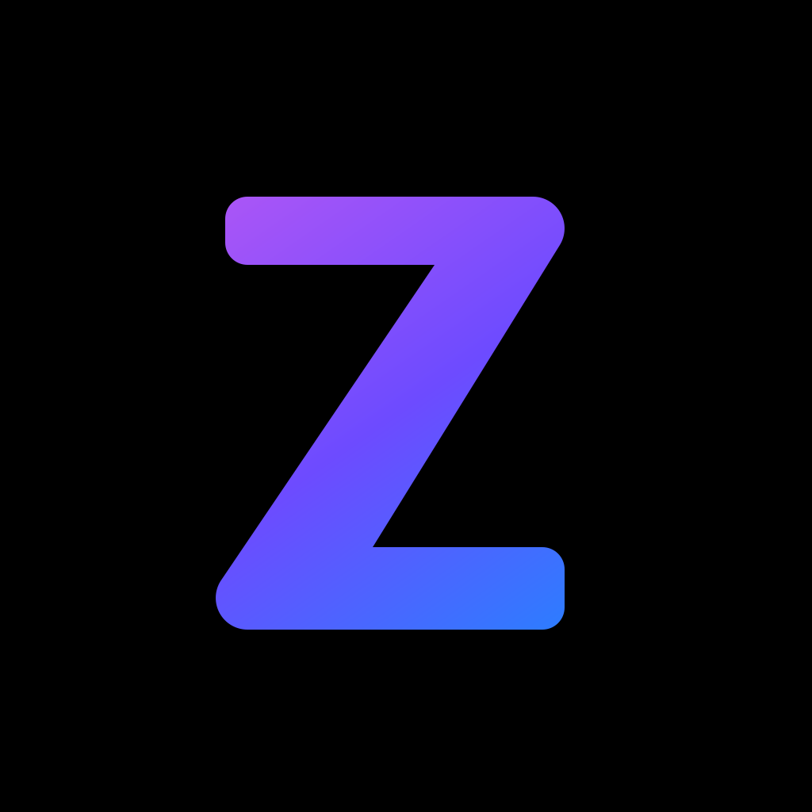
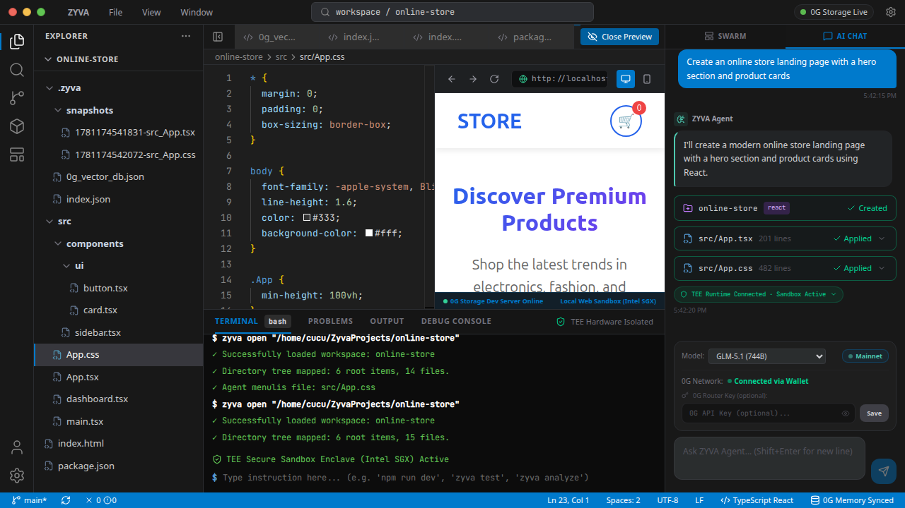

<div align="center">



# ZYVA

**AI-powered Cloud IDE — build and ship apps from your browser.**

[](https://github.com/titanxlayer/zyva/releases)
[](LICENSE)
[](https://github.com/titanxlayer/zyva/actions)
[](https://pc.0g.ai)

[**Try Cloud IDE →**](https://app.zyva.dev) · [**Download Desktop**](https://github.com/titanxlayer/zyva/releases) · [**Docs**](https://app.zyva.dev/docs) · [**zyva.dev**](https://zyva.dev)

</div>

---



---

## Download (Desktop App)

Latest release: **v0.4.0** — [all releases →](https://github.com/titanxlayer/zyva/releases/latest)

| Platform | Download |
|---|---|
| 🪟 **Windows** | [`ZYVA.Setup.0.4.0.exe`](https://github.com/titanxlayer/zyva/releases/download/v0.4.0/ZYVA.Setup.0.4.0.exe) |
| 🍎 **macOS** (Apple Silicon) | [`ZYVA-0.4.0-arm64.dmg`](https://github.com/titanxlayer/zyva/releases/download/v0.4.0/ZYVA-0.4.0-arm64.dmg) |
| 🐧 **Linux** (.deb) | [`zyva-desktop_0.4.0_amd64.deb`](https://github.com/titanxlayer/zyva/releases/download/v0.4.0/zyva-desktop_0.4.0_amd64.deb) |
| 🐧 **Linux** (AppImage) | [`ZYVA-0.4.0.AppImage`](https://github.com/titanxlayer/zyva/releases/download/v0.4.0/ZYVA-0.4.0.AppImage) |

> Builds are currently unsigned — your OS may warn on first launch. Prefer the browser? Just use the **[Cloud IDE](https://app.zyva.dev)** (no install).
>
> **Self-hosting?** A container image is published to [GitHub Packages (GHCR)](https://github.com/titanxlayer/zyva/pkgs/container/zyva): `docker pull ghcr.io/titanxlayer/zyva:latest`

---

## What is ZYVA?

ZYVA is a Lovable-style AI coding environment with two modes:

| | Cloud IDE | Desktop App |
|---|---|---|
| **Access** | Browser — no install | Electron — local |
| **Execution** | WebContainer (browser) + E2B sandbox | Local machine directly |
| **Isolation** | 0G TEE + Firecracker VM per session | User's own machine |
| **Storage** | 0G persistent storage | Local filesystem |
| **AI** | 0G Private Computer (TEE-attested) | 0G Private Computer |

**Cloud IDE is the primary product.** The desktop app stays available for teams that need fully local control.

---

## AI Inference — 0G Private Computer

All inference runs on **[0G Private Computer](https://pc.0g.ai)** — OpenAI-compatible API, every request inside a TEE. No BYOK required.

| Model | Context | Best for |
|---|---|---|
| `minimax-m3` ⭐ | 1M | Multimodal, default |
| `glm-5.1` | 207K | Long-horizon coding |
| `qwen3.7-max` | 1M | Function calling |
| `qwen3.6-plus` | 1M | Multilingual |
| `deepseek-v4-pro` | 1M | Agentic coding |

---

## Stack

| Layer | Technology |
|---|---|
| UI shell | Next.js 16 (App Router), React 19, Monaco editor, Tailwind v4, Zustand, Framer Motion |
| Inference | **0G Private Computer** (`pc.0g.ai`) — OpenAI-compatible, TEE-attested |
| Auth | NextAuth v5 — Google, GitHub OAuth + SIWE wallet (0G Chain) |
| Database | PostgreSQL (Prisma v7) — users, sessions, projects, traces |
| Sandbox | E2B — on-demand, build/install only, torn down after task |
| Git | Real `git commit + push` to GitHub from the IDE Source Control panel |
| Embeddings | Qwen `text-embedding-v4` (DashScope) or local Ollama |
| Rerank | `qwen3-rerank` |
| Vector store | Local file-backed (default) or Qdrant |
| Observability | Local trace store + optional Langfuse |
| Desktop | Electron wrapper around Next.js standalone build |

---

## Repository Map

```
zyva-app/
├── src/
│   ├── app/                    Next.js App Router
│   │   ├── api/
│   │   │   ├── agent/
│   │   │   │   ├── run/        Iterative agent loop (tools) + self-healing build (SSE)
│   │   │   │   └── stream/     Multi-agent graph (Architect → Review) (SSE)
│   │   │   ├── ai/             Chat completions (streaming, 0G PC / ZYVA)
│   │   │   ├── auth/           NextAuth route handler
│   │   │   ├── checkpoints/    List snapshots + rollback
│   │   │   ├── git/            Real git commit + push + clone from GitHub
│   │   │   ├── index/          Semantic index of a project
│   │   │   ├── sandbox/        E2B preview (cloud) + build tasks + kill
│   │   │   ├── terminal/       Secure command execution
│   │   │   ├── traces/         Observability trace list
│   │   │   └── workspace/      File tree, save, create project (+ design retrieval), browse
│   │   ├── auth/               Sign-in + error pages
│   │   ├── docs/               Public documentation pages
│   │   └── icon.png            App favicon (ZYVA logo)
│   │
│   ├── components/
│   │   ├── AgentSwarm.tsx      Right panel: Swarm + AI Chat + Agent Loop toggle
│   │   ├── ChatComponents.tsx  Markdown, action cards, TEE badge
│   │   ├── LivePreview.tsx     WebContainer preview (+ E2B "Open in browser", cloud only)
│   │   ├── MonacoCodeEditor.tsx Editor + Prettier + Emmet + snippets
│   │   ├── SidebarPanel.tsx    Explorer, Source Control, Extensions
│   │   └── TerminalConsole.tsx Secure terminal with TEE badge
│   │
│   ├── engine/                 ← Core runtime
│   │   ├── config.ts           Central env/config
│   │   ├── tools/              Agent tool schema + executor (read/write/edit/grep/run/db)
│   │   ├── orchestrator/
│   │   │   ├── runAgentLoop.ts ReAct loop: reason → tool call → observe → repeat ⭐
│   │   │   ├── graph.ts        Multi-agent graph (Architect/Frontend/Backend/Review)
│   │   │   ├── runAgent.ts     Single bounded reasoning step
│   │   │   └── agents.ts       Agent role definitions
│   │   ├── build/              Self-healing build loop (run build → fix errors → repeat)
│   │   ├── db/                 Per-project SQLite (better-sqlite3, lazy)
│   │   ├── design/             Design-template library retrieval (embeddings)
│   │   ├── repomap/            Aider-style repo map (symbol outline)
│   │   ├── retrieval/          Chunker + vector store + embed/rerank query
│   │   ├── execution/          E2B sandbox (preview + build, cloud only)
│   │   ├── git/                Real git operations (commit/push/clone)
│   │   ├── patch/              SEARCH/REPLACE + snapshot/rollback
│   │   ├── providers/
│   │   │   ├── ogpc.ts         0G Private Computer — primary inference ⭐
│   │   │   ├── zyva.ts         ZYVA (DO Inference Router) — internal/locked
│   │   │   ├── dashscope.ts    Qwen embeddings + rerank
│   │   │   ├── ollama.ts       Local embeddings (optional)
│   │   │   ├── gateway.ts      Embedding gateway (optional)
│   │   │   └── types.ts        Provider interfaces (+ tool support)
│   │   ├── security/           Command policy (allow/approve/deny)
│   │   ├── observability/      Trace store + Langfuse forwarder
│   │   └── tee/                Honest TEE attestation state
│   │
│   ├── lib/                    auth-guard, github, prisma, wallet (SIWE),
│   │                           workspace-isolation, extensions, snippets, file-icons
│   ├── auth.ts                 NextAuth v5 config (Google/GitHub/SIWE)
│   ├── middleware.ts           Edge auth middleware
│   └── store/useIdeStore.ts    Zustand global state
│
├── templates/                  Injected into every new user project
│   ├── CLAUDE.md · AGENTS.md · DESIGN.md   Guidance files
│   └── design-library/         74 curated DESIGN.md systems + embeddings (retrieval)
│
├── landing/                    Static landing page (zyva.dev)
├── desktop/                    Electron wrapper (main.js, prepackage.mjs)
├── gateway/                    Standalone embedding gateway (server mode)
├── prisma/schema.prisma        DB schema (users, sessions, projects, traces)
├── Dockerfile                  Cloud IDE container image (→ GHCR / Packages)
└── .github/workflows/
    ├── ci.yml                  Build + lint on push
    ├── release.yml             Cross-platform desktop builds on tag
    └── docker.yml              Container image → GitHub Packages (GHCR)
```

---

## Getting Started

```bash
git clone https://github.com/titanxlayer/zyva
cd zyva-app
npm install
npx prisma generate
cp .env.example .env.local   # add your 0G PC API key
npm run dev                  # http://localhost:3000
```

### Environment

| Var | Purpose |
|---|---|
| `OG_PC_API_KEY` | 0G Private Computer — [pc.0g.ai](https://pc.0g.ai) |
| `OG_PC_BASE_URL` | `https://pc.0g.ai/v1` |
| `OG_PC_MODEL` | `minimax-m3` (default) |
| `E2B_API_KEY` | E2B sandbox — [e2b.dev](https://e2b.dev) |
| `DATABASE_URL` | PostgreSQL connection string |
| `NEXTAUTH_SECRET` | Random secret — `openssl rand -base64 32` |
| `NEXTAUTH_URL` | `https://your-domain.com` |
| `GOOGLE_CLIENT_ID/SECRET` | Google OAuth |
| `GITHUB_CLIENT_ID/SECRET` | GitHub OAuth |
| `DASHSCOPE_API_KEY` | Qwen embeddings + rerank |
| `ZYVA_WORKSPACES_ROOT` | Per-user workspace root directory |

### Build desktop

```bash
NEXT_STANDALONE=1 npm run build
cd desktop && npm run dist
```

---

## Security Model

- LLM **never** executes shell directly — all commands go through the policy layer
- **allow** → auto-run safe commands (`npm install`, `tsc`, `eslint`)
- **approve** → requires user confirmation (`rm`, `docker`, chaining)
- **deny** → blocked (`rm -rf`, `sudo`, fork bombs)
- Per-user workspace isolation — paths validated server-side
- E2B sandboxes scoped per user session, torn down after task
- 0G TEE attestation recorded for every inference request

---

## License

MIT — see [LICENSE](LICENSE)

Third-party components retain their licenses. See [NOTICE](NOTICE).
