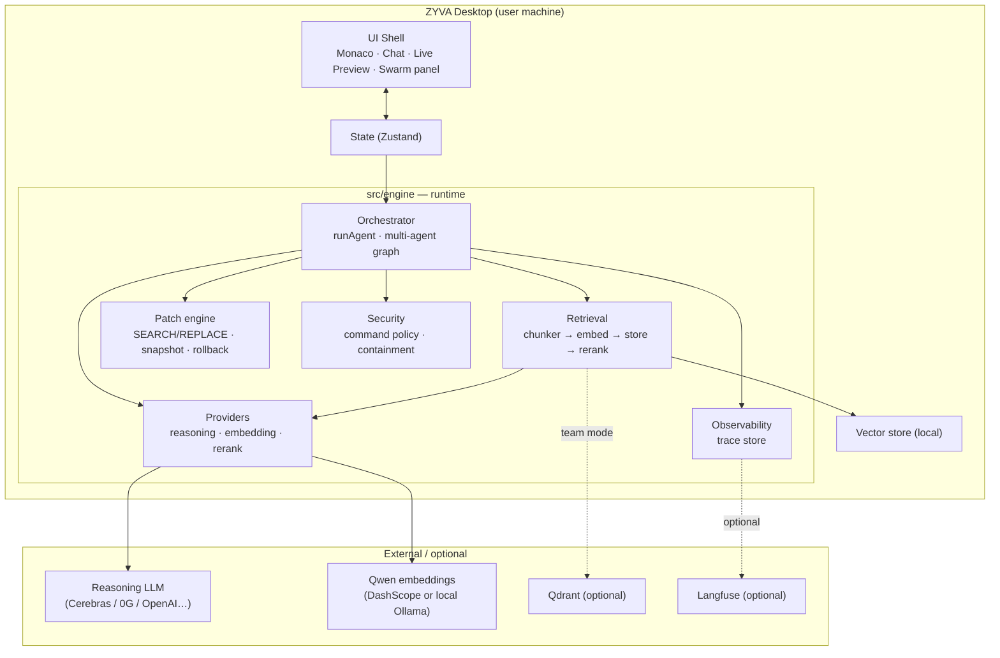
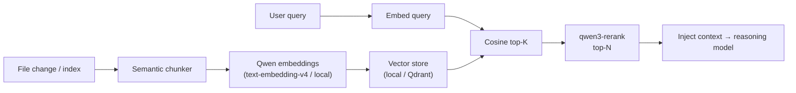
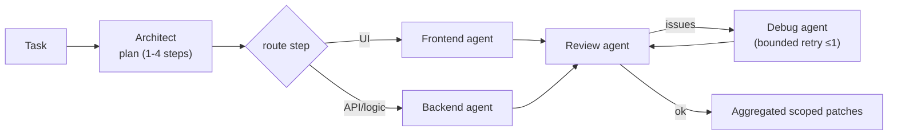

# ZYVA

**The AI IDE that never forgets.** An AI-native development environment with a VS Code–style UX, real semantic codebase memory, a bounded multi-agent coding graph, and a security-first execution layer.

ZYVA is built to run **locally on the user's machine** (desktop install) with optional cloud sync for teams. It is white-label and brings no third-party branding.

---

## Stack

| Layer | Technology |
|---|---|
| UI shell | Next.js 16 (App Router), React 19, Monaco editor, Tailwind v4, Zustand, Framer Motion |
| Reasoning | Provider-abstracted LLMs (Cerebras GLM for testing; 0G Router / OpenAI / Anthropic pluggable) — **BYO key** |
| Embeddings | Qwen — `text-embedding-v4` (DashScope cloud) or local Qwen (Ollama); switchable |
| Rerank | `qwen3-rerank` (two-stage retrieval) |
| Vector store | Local file-backed store (default, offline) or Qdrant (server/team) |
| Parser/chunker | Code-aware semantic chunker (tree-sitter seam) |
| Orchestration | Bounded multi-agent graph: Architect → Frontend/Backend → Review (SSE streaming) |
| Patch engine | Aider-style SEARCH/REPLACE + atomic writes + per-action snapshot & rollback |
| Execution | Command policy (allow / approve / deny) + project containment + timeout |
| Observability | Local trace store (always on) + optional Langfuse |

---

## Architecture



### Retrieval (semantic memory)



### Multi-agent graph (bounded)



Hard bounds: max steps, max retries, token caps, **no recursive self-invocation**. Every node is traced; progress streams to the Swarm panel via SSE.

---

## Security model

- The LLM **never** executes shell directly. Commands are classified:
  - **allow** — safe, may auto-run (`npm install`, `npm run build`, `eslint`, `tsc`, `pytest`…)
  - **approve** — requires explicit user confirmation (`rm`, `chmod`, `curl|bash`, `docker`, chaining…)
  - **deny** — never run (`rm -rf`, `sudo`, fork bombs, disk writes…)
- Execution is contained to the project directory and bounded by a timeout.
- Secrets live in `.env.local` (gitignored) and are never shipped in the client binary or exposed over HTTP.
- TEE status is reported honestly (`TEE Runtime Connected · Sandbox Active`); ZYVA does **not** claim "verified" attestation until a real quote exists.

---

## Getting started

```bash
npm install
cp .env.example .env.local   # fill in keys
npm run dev                  # http://localhost:3000
```

### Environment

See `.env.example`. Key variables:

| Var | Purpose |
|---|---|
| `CEREBRAS_API_KEY` | reasoning (testing) |
| `DASHSCOPE_API_KEY` / `DASHSCOPE_BASE` | Qwen embeddings + rerank |
| `ZYVA_EMBED_BACKEND` | `dashscope` \| `local` (Ollama) \| `gateway` |
| `ZYVA_EMBED_MODEL` / `ZYVA_EMBED_DIMS` | embedding model + dimensions (default 1024) |
| `ZYVA_VECTOR_STORE` | `local` (default) \| `qdrant` |
| `QDRANT_URL` / `QDRANT_API_KEY` | Qdrant (team mode) |
| `LANGFUSE_*` | optional observability |
| `ZYVA_AUTORUN_COMMANDS` | allow auto-run of allowlisted commands |

### Optional services (server/team mode)

```bash
docker compose up -d        # Qdrant (6333) + Langfuse (3030)
```

---

## Project structure

```
src/
  app/                 Next.js routes + API (chat, agent/run, agent/stream, index, terminal, traces, workspace)
  components/          UI (editor, chat, live preview, swarm panel)
  store/               Zustand state
  engine/              ← the real runtime (original ZYVA code, white-label)
    providers/         model provider abstraction (reasoning / embedding / rerank)
    retrieval/         chunker, vector store (local + Qdrant), index + query
    orchestrator/      runAgent + multi-agent graph + agent roles
    patch/             SEARCH/REPLACE patch engine + snapshot/rollback
    security/          command policy + containment
    observability/     trace store (+ Langfuse forwarder)
    tee/               honest TEE runtime state
gateway/               standalone embedding gateway (server mode)
landing/               static landing page
```

---

## Tests

```bash
node --env-file=.env.local scripts/test-cerebras.mjs
node scripts/test-preview-flow.mjs       # agent codes + live preview
node scripts/test-swarm-stream.mjs       # multi-agent streaming to Swarm panel
```

---

## License & notices

White-label product. Third-party components (when adapted) retain their licenses — see `NOTICE`. Permissive (MIT/Apache-2.0) only; no GPL/AGPL embedded.
